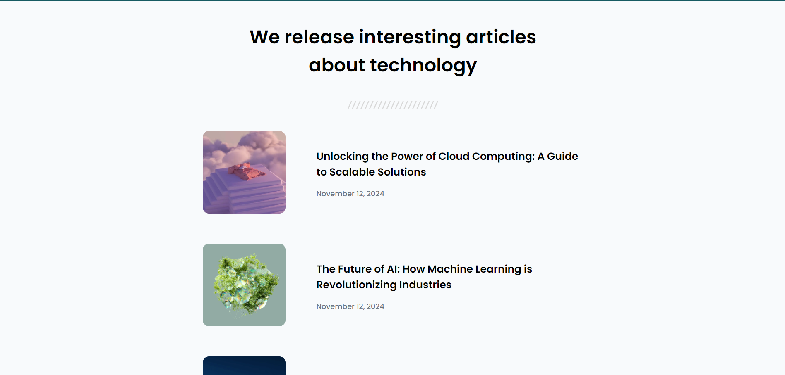

# Simple Article Listing

Este proyecto es una página web diseñada para mostrar una lista de artículos sobre temas tecnológicos. Proporciona una estructura simple pero eficaz para listar artículos con imágenes y detalles como el título y la fecha de publicación.

## Vista Previa



Puedes ver la versión demo en vivo aquí: [Simple Article Listing](https://ibrahim-003.github.io/Simple-Article-Listing/)

## Características

- **Responsiva:** La página se adapta a diferentes tamaños de pantalla utilizando etiquetas `<picture>` y `srcset` para cargar imágenes según el tamaño del dispositivo.
- **Estilo moderno:** Usa la fuente "Poppins" para una apariencia limpia y moderna.
- **Diseño estructurado:** Los artículos están organizados dentro de un contenedor flexbox, lo que garantiza un diseño consistente y fluido en todos los dispositivos.
- **Contenido semántico:** Utiliza etiquetas HTML semánticas como `<article>`, `<header>`, y `<section>` para mejorar la accesibilidad y el SEO.

## Estructura de Archivos

```
|-- index.html              # Página principal
|-- assets/
    |-- css/
    |   |-- reset.css       # Reseteo de estilos predeterminados del navegador
    |   |-- styles.css      # Estilos personalizados de la página
    |-- images/
    |   |-- Seperator.svg   # Separador gráfico de los encabezados
    |   |-- photo_1.png     #Images del articulo cloud computing
    |   |-- photo_2.png     # Imagen del artículo sobre 5G
    |   |-- photo_3.png     # Imagen del artículo sobre IA
```

## Instalación

1. Clona este repositorio en tu máquina local.
   ```bash
   git clone https://github.com/Ibrahim-003/Simple-Article-Listing.git
2. Asegúrate de tener conexión a Internet para cargar las fuentes de Google Fonts y los estilos CSS.
3. Abre `index.html` en tu navegador para ver la página.

## Uso

La página es fácilmente personalizable modificando los estilos en el archivo `styles.css` y ajustando el contenido en `index.html`. Puedes agregar más artículos, cambiar las imágenes o los títulos según lo necesites.

## Tecnologías Utilizadas

- HTML5
- CSS3
- Google Fonts

## Autor

Este proyecto fue creado por [Ibrahim Almeyda].
